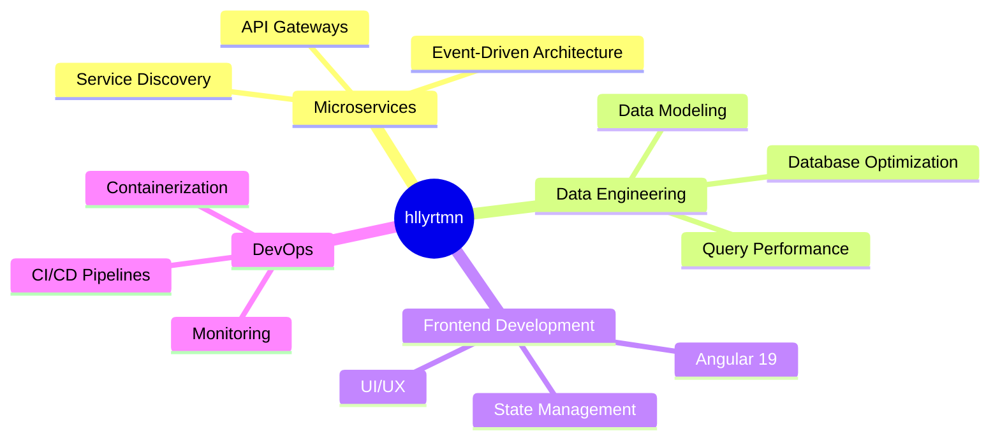

# 
👨‍💻 Halil Can Yurtman

  

  
  

## 
🌟 About Me

  
5+ years of experience developing enterprise solutions with Django, .NET, and Angular ecosystems.

  
Passionate about clean architecture, performance optimization, and database design.

## 
💼 Tech Stack

<table align="center">
  <tr>
    <td align="center" width="96">
      
       .NET Core
    </td>
    <td align="center" width="96">
      
       C#
    </td>
    <td align="center" width="96">
      
       Django
    </td>
    <td align="center" width="96">
      
       Python
    </td>
    <td align="center" width="96">
      
       Angular
    </td>
    <td align="center" width="96">
      
       TypeScript
    </td>
  </tr>
  <tr>
    <td align="center" width="96">
      
       PostgreSQL
    </td>
    <td align="center" width="96">
      
       SQL Server
    </td>
    <td align="center" width="96">
      
       Docker
    </td>
    <td align="center" width="96">
      
       Git
    </td>
    <td align="center" width="96">
      
       HTML5
    </td>
    <td align="center" width="96">
      
       CSS3
    </td>
  </tr>
</table>

## 
🚀 Current Projects & Interests

  <!-- Proje kartını burada göstermek için GitHub'da bir repo oluşturun ve aşağıdaki URL'de repo adını değiştirin -->
  <!-- 
  
  -->

## 
📊 GitHub Stats & Activity

  
  

   
  

  

## 
💡 My Development Principles

  
| Clean Code | Scalable Architecture | Continuous Learning | User-Centric Design |
|:----------:|:---------------------:|:-------------------:|:-------------------:|
| Writing maintainable, readable, and modular code | Designing systems that can grow with business needs | Always exploring new technologies and patterns | Creating solutions that solve real user problems |
  

## 
📫 Connect With Me

  
  
  

   
  

---

  

